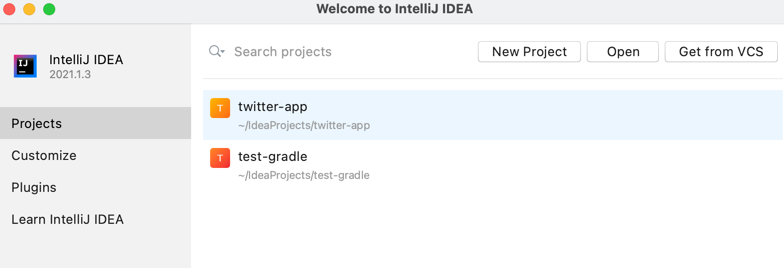
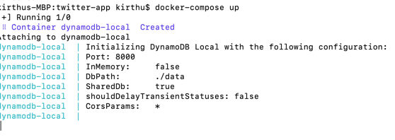

# twitter-app

## Steps to run them in the local
### Step:1 Open IntelliJ in your machine

### Step: 2 Open the twitter-app service downloaded from the github

### Go to the Terminal located at the bottom of the IntelliJ and run gradle build.
Command "gradle.bat build" for windows machines. "gradlew build" for Linux/Unix/Mac

### Now you would see gradle section on the right hand side like shown in this picture below.
go to application -> bootRun -> Right click and Run it.

### Open Postman or a browser and hit the below URL to make sure it is running.
http://localhost:8090/twitter-app/status

### Step:2 Running AWS DynamoDB in local.
#### Open a terminal/Commandline -> go to the location where you see docker-compose.yml file.
#### Run "docker-compose up" command and leave the terminal open.

### Step: 3 Creating tables in DynamoDB
#### Open a new terminal shell and Run the first three commands in db.sql file one by one.
You would find this file as part of the twitter-app under
twitter-app/src/main/resources/db.sql

### Hay!!! We should be able to Test it Now !!!