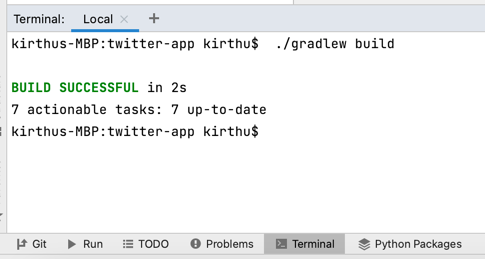
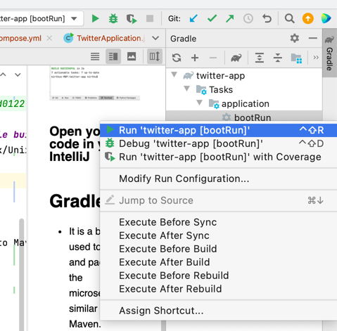

# twitter-app

## Step:1 Pre-requisites & Installation
### Laptop with access to the Internet
### Install Intellij or your choice of IDE to build a java based microservice. Link to download IntelliJ for your machine.
    Windows: https://www.jetbrains.com/idea/download/#section=windows
    Linux: https://www.jetbrains.com/idea/download/#section=linux
    Mac: https://www.jetbrains.com/idea/download/#section=mac
### Install Docker Desktop. Please select the binary to install based on type of machine(windows/linux/mac) that you use.
    https://www.docker.com/products/docker-desktop
https://docs.microsoft.com/en-us/virtualization/windowscontainers/quick-start/set-up-environment?tabs=Windows-10-and-11#install-docker
### Java JDK 1.8 or the latest for building the microservice.
### Install git 
    https://git-scm.com/book/en/v2/Getting-Started-Installing-Git
### Install Postman or similar API Tool. Link to install postman.
    https://www.postman.com/downloads/

## Step:2 How to download this service and Run in your local

## Set up the code in local
### Open IntelliJ 

### Go to the Terminal located at the bottom of the IntelliJ and run gradle build.
Command "gradle.bat build" for windows machines. "gradlew build" for Linux/Unix/Mac

### Now you would see gradle section on the right hand side like shown in this picture below.
go to application -> bootRun -> Right click and Run it.

### Open your code in your IntelliJ
     
## Gradle
 - It is a build tool used to build and package the microservice similar to Maven.
